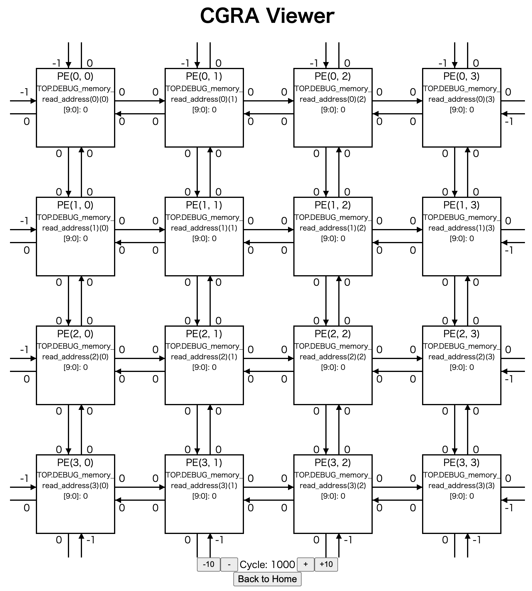

# CGRA-Debugger

## environment 
npm : 8.19.1

## How to Build
```bash
npm run dev # visualze for debug
npm run make # build (not package)
```

## Usage 
Select vcd file and JSON file for configuration.

```bash
# example configuration
{
  "CGRA": {
    "row_size": 4, 
    "column_size": 4,
    "neighbor_PE_size": 4
  }, # temporaly orthogonal network only
  "PE": {
    # input (upper -> right -> lower -> left)
    "input_signal": [ # (rowId, columnId) is PE position 
      "TOP.DEBUG_input_PE_data_1(${rowId-1})(${columnId})[31:0]",
      "TOP.DEBUG_input_PE_data_1(${rowId})(${columnId+1})[31:0]",
      "TOP.DEBUG_input_PE_data_1(${rowId+1})(${columnId})[31:0]",
      "TOP.DEBUG_input_PE_data_1(${rowId})(${columnId-1})[31:0]"
    ], 
    "output_signal": "TOP.pe_output(${rowId})(${columnId})[31:0]",
    "status_signal": [
      "TOP.DEBUG_memory_read_address(${rowId})(${columnId})[9:0]"
    ]
  }
}
```

